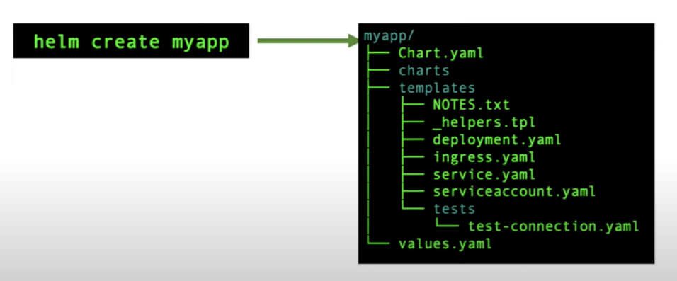
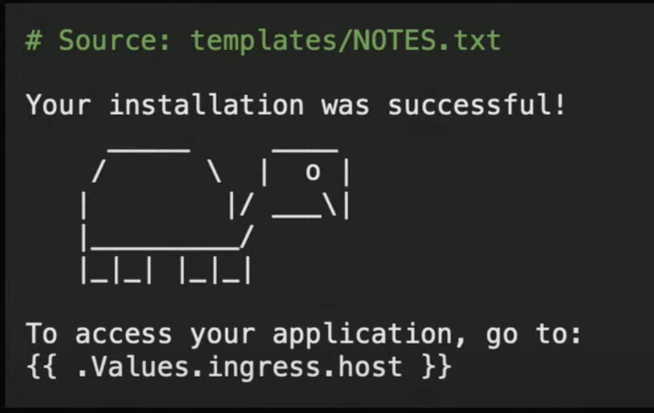

# Helm Charts
The package manager for Kubernetes

Helm is the best way to find, share, and use software built for Kubernetes.

Its a homebrew of Kubernetes in mac, or apt for kubernetes in linux 

> Helm helps you manage Kubernetes applications — Helm Charts help you define, install, and upgrade even the most complex Kubernetes application.

> Charts are easy to create, version, share, and publish

> Helm is a graduated project in the CNCF and is maintained by the Helm community

> Helm Packages are referred to as *Charts* - deployable unit for Kubernetes bound applications.


## Helm started in 2015


## Helm users Semantic Versioning 
```
https://semver.org/spec/v2.0.0.html
```
- When you break existing API, increment the **major** version  
- When you add a feature, increment the **minor** version  
- For bugs or non-feature changes, increment the **patch** version  


## Security - Helm Provenance and Integrity / signing charts
- Provenance - place of origin 
- Provenance records are stored in provenance files, which are stored alongside a packaged chart. For example, if a chart is named myapp-1.2.3.tgz, its provenance file will be myapp-1.2.3.tgz.prov
- Integrity / signing charts 
- Provenance files are generated at packaging time (helm package --sign ...), and can be checked by multiple commands, notably helm install --verify

## Supported for all 3 major Platforms 


## Website 
```
https://helm.sh/
```

## Artifacts 
```
https://artifacthub.io/
```


### Search a repo from command prompt helm 
```
helm search hub <name-of-chart>
```


## Install 

### MAC
```
brew install helm
```

### Windows
```
choco install kubernetes-helm
```

### Install from Source 
```
https://helm.sh/docs/intro/install/
```

## Current Version 

```
helm version

Output:-
version.BuildInfo{Version:"v3.17.3", GitCommit:"e4da49785aa6e6ee2b86efd5dd9e43400318262b", GitTreeState:"clean", GoVersion:"go1.24.2"}
```

## Helm chart from 1000 feet 




### Chart.yaml 
- Mainly for metadata
- Also can add dependencies 


### Values.yaml
- specify default settings for your chart


#### Override chart values from left to right


### Template directory 
- Anything here is treated as yaml template
- it has GO-LANG templating language
- Take the values.yaml file, apply to this template and convert it in kube yaml


### Templates / helper file (optional)
- this is for section of yaml that you may want to repete it in all the templates 
- like a specific label for that application


### Templates / Test 
- any file which has test in the name is treated as helm test file 
- once you install the application using helm then you can use these files to check, eg:- if my databas is up 


### Templates / NOTES.txt
- Once the application is completely installed, it will pring the message
- how to use the application
- application is installed
- we can add ASCII turtle 



## Installing a Helm chart 
- Can install from local developer machine where chart is present
- Can intall from chart repository 


## Check Release status 
- Also we get the notes here from the template/NOTES.txt


## list what is running


## Upgrade a specific helm release
```
helm upgrade myrelease ./myapp --set image.tag=1.16.1-alpine
```


## Rollback to previous version 

```
helm rollback myrelease 1
```


## Delete a release


## Create Chart for nodejstemplate Microservice 

```
helm create <NAME>
helm create nodejstemplate
```


## Do helm lint 

```
helm lint

Output:-
==> Linting .

1 chart(s) linted, 0 chart(s) failed
```

## Dry run 

```
 helm install nodejstemplate nodejstemplate --dry-run --debug

install.go:225: 2025-04-19 23:03:52.9329 +0800 +08 m=+0.024805293 [debug] Original chart version: ""
install.go:242: 2025-04-19 23:03:52.932953 +0800 +08 m=+0.024857751 [debug] CHART PATH: /Users/alokadhao/Documents/github/imagincloud/helm-chart/nodejstemplate

NAME: nodejstemplate
LAST DEPLOYED: Sat Apr 19 23:03:54 2025
NAMESPACE: default
STATUS: pending-install
REVISION: 1
USER-SUPPLIED VALUES:
{}

COMPUTED VALUES:
ContainerPort: 9001
global:
  namespace: default
image:
  pullPolicy: IfNotPresent
  repository: casaacr01.azurecr.io/nodejstemplate
  tag: v1.0.0
name: nodejstemplate
replicaCount: 1
service:
  port: 80
  type: ClusterIP

HOOKS:
---
# Source: nodejstemplate/templates/tests/test-connection.yaml
apiVersion: v1
kind: Pod
metadata:
  name: "nodejstemplate-test-connection"
  labels:
    helm.sh/chart: nodejstemplate-1.0.0
    app.kubernetes.io/name: nodejstemplate
    app.kubernetes.io/instance: nodejstemplate
    app.kubernetes.io/version: "1.16.0"
    app.kubernetes.io/managed-by: Helm
  annotations:
    "helm.sh/hook": test
spec:
  containers:
    - name: wget
      image: busybox
      command: ['wget']
      args: ['nodejstemplate:80']
  restartPolicy: Never
MANIFEST:
---
# Source: nodejstemplate/templates/service.yaml
apiVersion: v1
kind: Service
metadata:
  name: nodejstemplate
  labels:
    helm.sh/chart: nodejstemplate-1.0.0
    app.kubernetes.io/name: nodejstemplate
    app.kubernetes.io/instance: nodejstemplate
    app.kubernetes.io/version: "1.16.0"
    app.kubernetes.io/managed-by: Helm
spec:
  type: ClusterIP
  ports:
    - port: 80
      targetPort: http
      protocol: TCP
      name: http
---
# Source: nodejstemplate/templates/deployment.yaml
apiVersion: apps/v1
kind: Deployment
metadata:
  name: nodejstemplate-nodejstemplate
  namespace: default
  labels:
    app: nodejstemplate
spec:
  replicas: 1
  selector:
    matchLabels:
      app: nodejstemplate
  template:
    metadata:
      labels:
        app: nodejstemplate
    spec:
      containers:
        - name: nodejstemplate
          image: casaacr01.azurecr.io/nodejstemplate:v1.0.0
          ports:
            - containerPort: 9001
```

## install nodejs Chart

```
helm install nodejstemplate nodejstemplate                  

NAME: nodejstemplate
LAST DEPLOYED: Sat Apr 19 23:05:04 2025
NAMESPACE: default
STATUS: deployed
REVISION: 1
NOTES:
1. Get the application URL by running these commands:
```